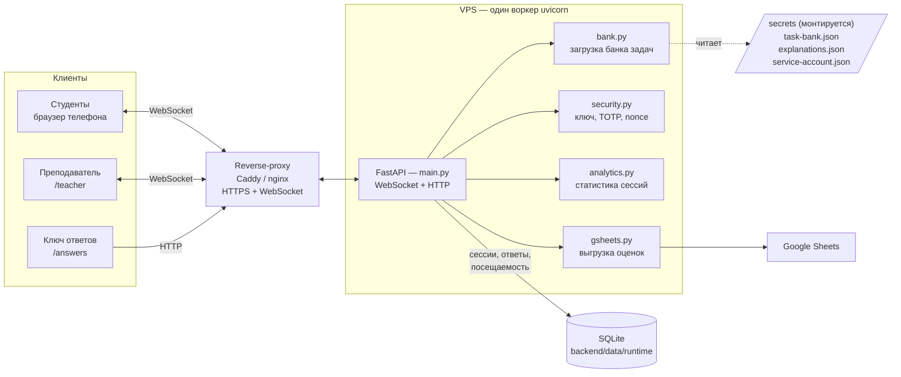

# AlgoClimb

AlgoClimb — веб-приложение для синхронных интерактивных опросов на лекциях по алгоритмам,
структурам данных и теории графов. Студенты подключаются по QR-коду и отвечают на вопросы
с телефонов; на экране преподавателя в реальном времени отображаются лобби, прогресс и
лидерборд. По завершении сессии доступен разбор заданий, результаты можно выгрузить в
Google Sheets.

Бэкенд построен на **FastAPI** (один процесс `uvicorn`, состояние сессии хранится в памяти).
Фронтенд — статические HTML-страницы. История сессий сохраняется в SQLite и переживает
перезапуски.

## Архитектура



Обмен с клиентами идёт по WebSocket; при разрыве соединения страница переподключается и
восстанавливает состояние с сервера. Банк вопросов с правильными ответами читается из
примонтированной папки `secrets/` и не входит ни в репозиторий, ни в Docker-образ.

> **Важно:** воркер должен быть ровно один — состояние сессии хранится в памяти процесса.
> Запуск с `--workers` не поддерживается.

## Структура проекта

```
backend/     FastAPI-приложение
  main.py      WebSocket-сессия + HTTP-маршруты
  bank.py      загрузка банка задач (с откатом на демо-банк)
  db.py        слой SQLite (attendance, answers, results, events, sessions)
  security.py  ключ преподавателя, TOTP-коды, одноразовые nonce
  analytics.py статистика по сессиям и задачам
  gsheets.py   выгрузка оценок в Google Sheets
  config/      config.example.json — шаблон конфигурации
  data/        демо-банк + runtime/ (БД SQLite, логи сессий)
frontend/    HTML: teacher / student / answers + vendor/ (KaTeX)
secrets/     приватный банк, разборы, ключ сервисного аккаунта (монтируется)
tools/       вспомогательные скрипты
```

## Сценарий сессии

Модель синхронная: весь класс отвечает на один вопрос одновременно.

1. Преподаватель открывает `/teacher` — отображаются QR-код и лобби.
2. Студенты сканируют QR, вводят ник и выбирают иконку. В этот момент фиксируется
   посещаемость.
3. Преподаватель запускает сессию — всем выдаётся первый вопрос.
4. На каждый вопрос действует таймер. Раунд закрывается, когда ответили все участники или
   истекло время, после чего выдаётся следующий вопрос. Одна попытка на вопрос.
5. Очки начисляются по формуле `база × сложность × скорость` с бонусом за серию верных
   ответов. Неверный или пропущенный ответ — 0 очков. Варианты перемешиваются каждый раунд.
6. На экране преподавателя отображаются прогресс, лидерборд, счётчик ответивших и отметки
   об уходе со вкладки.
7. По завершении показываются итоги, результаты записываются в базу, студентам открывается
   разбор заданий.

## Быстрый старт (локально)

Требуется **Python 3.11+**.

```bash
git clone https://github.com/21astroboy/Algoclimb.git algoclimb
cd algoclimb
python3 -m venv .venv && . .venv/bin/activate
pip install -r requirements.txt
python -m uvicorn main:app --app-dir backend --host 0.0.0.0 --port 3000 --ws wsproto
```

Альтернатива — одна команда, которая сама выберет Docker или Python: `./algoclimb up`.
В консоль выводятся ключ преподавателя и адреса экранов.

Без приватного банка приложение запускается на демо-банке (`task-bank.example.json`).

## Экраны

| Роль | Адрес |
|------|-------|
| Преподаватель | `PUBLIC_URL/teacher` — вход по ключу |
| Студенты | `PUBLIC_URL/` — адрес из QR-кода |
| Ключ ответов | `PUBLIC_URL/answers` — приватная страница с ответами |

Страница `/answers` содержит правильные ответы и не предназначена для студентов.

## API

HTTP- и WebSocket-эндпоинты документированы через OpenAPI. Интерактивная документация
(Swagger UI) доступна по адресу `PUBLIC_URL/docs`, ReDoc — `PUBLIC_URL/redoc`, схема —
`PUBLIC_URL/openapi.json`.

По умолчанию документация скрыта (ответ 404). Чтобы включить её, задайте `DOCS=1` в `.env`
и выполните `./algoclimb restart`.

## Развёртывание на VPS

На сервере требуется **Docker** (рекомендуется) либо **Python 3.11+**. Скрипт `./algoclimb`
определяет доступную среду автоматически.

```bash
# 1. Получить код
git clone https://github.com/21astroboy/Algoclimb.git algoclimb
cd algoclimb

# 2. Загрузить приватные файлы (банк задач и разборы)
scp secrets/task-bank.json secrets/explanations.json <user>@<vps>:~/algoclimb/secrets/

# 3. Настроить окружение
cp .env.example .env
nano .env
```

Минимальная конфигурация в `.env` — публичный адрес, который попадёт в QR-код:

```
PUBLIC_URL=https://algoclimb.example.ru   # или http://<ip>:3000
TEACHER_KEY=<постоянный-ключ>
```

Запуск:

```bash
./algoclimb up        # сборка и запуск в фоне; выводит ключ преподавателя
```

Прочие команды: `logs`, `key`, `status`, `restart`, `down`. Данные в `backend/data/runtime`
сохраняются между перезапусками и пересборками.

Обновление версии:

```bash
git pull
./algoclimb restart
```

Замена файлов в `secrets/` не требует пересборки (они монтируются на лету) — достаточно
`./algoclimb restart`. После изменения зависимостей (`requirements.txt`) требуется
`./algoclimb up`.

### HTTPS и домен

Приложение слушает HTTP на `PORT`. Для домена и TLS используйте reverse-proxy с включённым
проксированием WebSocket (проброс заголовков `Upgrade` и `Connection`). После настройки
укажите `PUBLIC_URL=https://домен` в `.env` и выполните `./algoclimb restart`.

Caddy проксирует WebSocket без дополнительной настройки:

```
algoclimb.example.ru {
    reverse_proxy 127.0.0.1:3000
}
```

Для nginx необходимо увеличить таймауты проксирования: WebSocket-соединение может
простаивать между вопросами и в лобби, что приводит к обрыву при стандартном таймауте.

```nginx
server {
    server_name algoclimb.example.ru;
    location / {
        proxy_pass http://127.0.0.1:3000;
        proxy_http_version 1.1;
        proxy_set_header Upgrade $http_upgrade;
        proxy_set_header Connection "upgrade";
        proxy_set_header Host $host;
        proxy_set_header X-Forwarded-For $proxy_add_x_forwarded_for;
        proxy_read_timeout  3600s;
        proxy_send_timeout  3600s;
    }
}
```

### Безопасность входа

- `TEACHER_KEY` — ключ доступа к экрану преподавателя.
- `QR_ROTATION=1` включает сменные одноразовые коды входа (TOTP): код в QR-коде меняется
  каждые `QR_INTERVAL` секунд, повторный вход по устаревшему коду невозможен.
- Swagger `/docs` по умолчанию скрыт; включается через `DOCS=1`.

## Выгрузка оценок в Google Sheets

После завершения сессии на экране преподавателя доступна выгрузка результатов. Предпросмотр
показывает, кого и в какой столбец будут записаны результаты, без изменения таблицы.
Выгрузка проставляет участникам баллы в новый столбец на листе «Оценки» соответствующего
потока. Отсутствующим участникам ничего не записывается.

Настройка (выполняется один раз):

1. **Сервисный аккаунт Google.** В [Google Cloud Console](https://console.cloud.google.com/)
   создайте проект, включите **Google Sheets API** и **Google Drive API**, затем создайте
   учётную запись службы (**Credentials → Create credentials → Service account**) и ключ к
   ней (**Keys → Add key → JSON**).
2. **Доступ к таблицам.** В каждой таблице потока предоставьте email сервисного аккаунта
   (вида `…@проект.iam.gserviceaccount.com`) права **редактора**.
3. **Ключ на сервере.** Поместите JSON-файл в `secrets/`:
   ```bash
   scp <ключ>.json <user>@<vps>:~/algoclimb/secrets/service-account.json
   ```
4. **Активация.** Идентификаторы таблиц задаются в `config.json` (`gsheets.streams`).
   Установите `GSHEETS=1` в `.env` и выполните `./algoclimb up`.

Сопоставление участника с записью в таблице выполняется по логину (лист «Данные для входа»:
группа и ФИО) и строке на листе «Оценки».

## Конфигурация — `backend/config/config.json`

Рабочий `config.json` не хранится в репозитории; образцом служит `config.example.json`.
Основные параметры:

- **demo** — выбор `count` случайных задач для демонстрации (`onePerType` — по одной каждого
  типа). Отключение использует весь банк.
- **timeLimits** — лимит времени на вопрос по типам заданий.
- **scoring** — `base`, `minFraction` (минимальная доля очков), `streakStep` / `streakMax`
  (бонус за серию).
- **activeTasks** — пустое значение использует весь банк; иначе список идентификаторов задач
  в заданном порядке.
- **qrRotation** — режим сменных одноразовых кодов входа.
- **gsheets** — параметры выгрузки оценок.

Ряд параметров дублируется переменными окружения (`QR_ROTATION`, `DOCS`, `GSHEETS` и др.);
полный список описан в `.env.example`.
