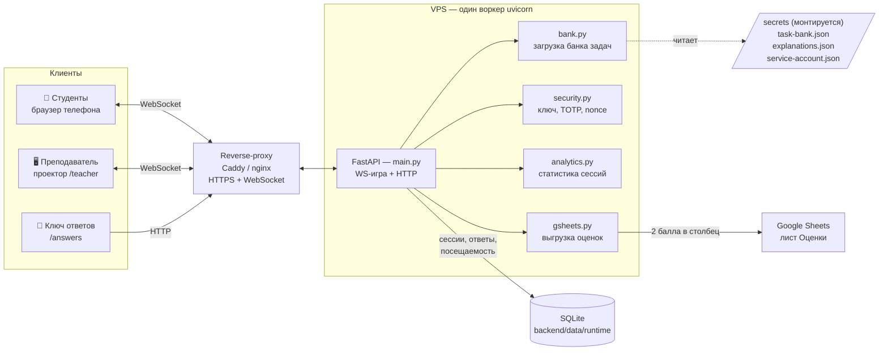

# AlgoClimb

Интерактивное веб-приложение для лекций по «Алгоритмам и структурам данных» и «Теории
графов». Весь класс играет синхронно: студенты заходят по QR, отвечают на один и тот же
вопрос с телефонов, а на проекторе — лобби, гора прогресса и живой лидерборд. После игры
каждый видит разбор, а оценки можно выгрузить в Google Sheets.

Бэкенд — **FastAPI** (один процесс `uvicorn`, состояние игры живёт в памяти). Фронтенд —
статические HTML-страницы. История сессий хранится в SQLite и переживает перезапуски.

## Как это устроено



Запросы студентов и преподавателя идут по WebSocket; при разрыве связи страница сама
переподключается и подхватывает состояние с сервера (очки и ответы не теряются). Банк
вопросов с правильными ответами читается из примонтированной папки `secrets/` и **не
попадает ни в Git, ни в Docker-образ** — иначе студенты нашли бы ответы.

> **Важно:** воркер должен быть ровно один — состояние игры в памяти процесса. Несколько
> воркеров рассинхронизируют игру, поэтому `--workers` использовать нельзя.

## Структура проекта

```
backend/     FastAPI-приложение
  main.py      WS-игра + HTTP-маршруты
  bank.py      загрузка банка задач (с откатом на демо-банк)
  db.py        слой SQLite (attendance, answers, results, events, sessions)
  security.py  ключ преподавателя, TOTP-коды, одноразовые nonce
  analytics.py статистика по сессиям и задачам
  gsheets.py   выгрузка оценок в Google Sheets
  config/      config.example.json — шаблон (свой config.json в Git не хранится)
  data/        демо-банк + runtime/ (БД SQLite, логи сессий)
frontend/    HTML: teacher / student / answers + vendor/ (KaTeX)
secrets/     приватный банк, разборы, ключ сервисного аккаунта — монтируется, не в Git
tools/       loadtest.py — нагрузочный тест по WebSocket
```

## Как идёт сессия

Модель **синхронная** — весь класс отвечает на один вопрос одновременно.

1. Преподаватель открывает `/teacher` на проекторе — там QR и лобби.
2. Студенты сканируют QR, вводят выданный ник, выбирают иконку → попадают в лобби.
   В этот момент фиксируется посещаемость.
3. Преподаватель жмёт **Старт** — всем выдаётся первый вопрос.
4. На каждый вопрос идёт таймер. Раунд закрывается, когда ответили все или вышло время;
   тогда автоматически выдаётся следующий. Одна попытка на вопрос.
5. Очки = `база × сложность × скорость` + бонус за серию верных ответов подряд. Неверный
   ответ или его отсутствие — 0. Варианты каждый раунд перемешиваются.
6. На экране преподавателя — гора прогресса, живой лидерборд, счётчик ответивших, отметки
   об уходе со вкладки (⚠) и кнопка выгнать студента.
7. **Завершить** — показываются итоги (лидерборд + «биатлонные» кружки верно/неверно/нет
   ответа по каждому вопросу), всё пишется в базу, студентам показывается разбор.
8. **Сброс** — новая сессия.

## Быстрый старт (локально)

Нужен **Python 3.11+**.

```bash
git clone https://github.com/21astroboy/Algoclimb.git algoclimb
cd algoclimb
python3 -m venv .venv && . .venv/bin/activate
pip install -r requirements.txt
python -m uvicorn main:app --app-dir backend --host 0.0.0.0 --port 3000 --ws wsproto
```

Или одной командой (сама выберет Docker или Python): `./algoclimb up`. В консоли появится
ключ преподавателя и адреса экранов.

Без приватного банка приложение поднимется на демо-банке (`task-bank.example.json`) — этого
достаточно, чтобы всё потыкать.

## Экраны

| Кто | Адрес |
|-----|-------|
| Преподаватель (проектор) | `PUBLIC_URL/teacher` — вход по ключу |
| Студенты | `PUBLIC_URL/` — сюда ведёт QR |
| Ключ ответов | `PUBLIC_URL/answers` — приватная страница со всеми ответами |

Ключ ответов и экран преподавателя не отдают правильные ответы студентам. Не давай адрес
`/answers` студентам.

---

## Развёртывание на VPS

На сервере нужен либо **Docker** (рекомендуется), либо **Python 3.11+**. Скрипт `./algoclimb`
сам определит, что доступно.

```bash
# 1. Забрать код
git clone https://github.com/21astroboy/Algoclimb.git algoclimb
cd algoclimb

# 2. Докинуть приватные файлы со своей машины (банк + разборы)
scp secrets/task-bank.json secrets/explanations.json <user>@<vps>:~/algoclimb/secrets/

# 3. Настроить окружение
cp .env.example .env
nano .env          # как минимум PUBLIC_URL; по желанию TEACHER_KEY
```

Минимум в `.env` — публичный адрес, который попадёт в QR:

```
PUBLIC_URL=https://algoclimb.example.ru   # или http://<ip>:3000
TEACHER_KEY=<свой-постоянный-ключ>
```

Запуск — одна команда:

```bash
./algoclimb up        # собрать и стартовать в фоне, напечатает ключ преподавателя
```

Остальные команды: `logs` (смотреть логи), `key` (показать ключ), `status`, `restart`,
`down`. История в `backend/data/runtime` сохраняется между перезапусками и пересборками.

Обновление версии:

```bash
git pull
./algoclimb restart   # Docker пересоберёт образ; данные в runtime не тронутся
```

> Подмена банка не требует пересборки: файлы в `secrets/` монтируются на лету, достаточно
> `./algoclimb restart`. А вот после изменения зависимостей (`requirements.txt`) нужен
> именно `./algoclimb up` (пересборка образа).

### HTTPS и домен

Приложение слушает обычный HTTP на `PORT`. Для домена и TLS поставь перед ним reverse-proxy
и **обязательно разреши WebSocket** (проброс `Upgrade`/`Connection`). Затем укажи
`PUBLIC_URL=https://домен` в `.env` и `./algoclimb restart`.

Caddy проксирует WebSocket сам и не режет idle-таймаут:

```
algoclimb.example.ru {
    reverse_proxy 127.0.0.1:3000
}
```

**nginx — обязательно подними таймауты!** По умолчанию он рвёт соединение после 60 с тишины,
а между вопросами и в лобби WebSocket как раз «молчит» — отсюда массовые отвалы студентов:

```nginx
server {
    server_name algoclimb.example.ru;
    location / {
        proxy_pass http://127.0.0.1:3000;
        proxy_http_version 1.1;
        proxy_set_header Upgrade $http_upgrade;
        proxy_set_header Connection "upgrade";
        proxy_set_header Host $host;
        proxy_set_header X-Forwarded-For $proxy_add_x_forwarded_for;
        proxy_read_timeout  3600s;   # по умолчанию было 60s
        proxy_send_timeout  3600s;
    }
}
```

Если reverse-proxy нет и студенты заходят прямо на `http://IP:3000` — таймаут не грозит.
Студенческая страница всё равно переподключается при обрыве и восстанавливает состояние.

### Безопасность входа

- `TEACHER_KEY` — ключ преподавателя; не показывай студентам.
- `QR_ROTATION=1` включает сменные одноразовые коды входа (TOTP): код в QR меняется каждые
  `QR_INTERVAL` секунд, повторный вход по старому коду невозможен.
- Swagger `/docs` по умолчанию **скрыт** (404). Открыть для отладки: `DOCS=1` в `.env` и
  `./algoclimb restart`.

## Выгрузка оценок в Google Sheets

После игры на экране преподавателя появляется карточка **«Выгрузка в Google Sheets»**.
Кнопка *Предпросмотр* показывает, кого и в какой столбец запишет, ничего не меняя; кнопка
*Выгрузить в Оценки* проставляет участникам **2 балла** в новый столбец `Algoclimb №n` на
листе «Оценки» таблицы их потока. Отсутствующим не ставится ничего.

Что нужно один раз настроить:

1. **Сервисный аккаунт Google.** В [Google Cloud Console](https://console.cloud.google.com/)
   создай проект, включи **Google Sheets API** и **Google Drive API**, затем
   **Credentials → Create credentials → Service account** и для него **Keys → Add key →
   JSON**. Скачанный файл — это доступ, храни его как пароль.
2. **Доступ к таблицам.** В обеих таблицах потоков нажми *Share* и добавь email сервисного
   аккаунта (вида `…@проект.iam.gserviceaccount.com`) как **Редактора**.
3. **Ключ на сервер.** Положи файл в `secrets/` рядом с банком:
   ```bash
   scp <ключ>.json <user>@<vps>:~/algoclimb/secrets/service-account.json
   ```
4. **Включить.** Id таблиц уже прописаны в `config.example.json` (`gsheets.streams`).
   Остаётся `echo 'GSHEETS=1' >> .env` и `./algoclimb up` (пересборка — ставятся `gspread` и
   `google-auth`). Сначала жми *Предпросмотр*, затем *Выгрузить*.

Сопоставление: логин студента → лист «Данные для входа» (Группа + ФИО) → строка на листе
«Оценки» по Группе и «Фамилия Имя».

## Настройки — `backend/config/config.json`

Рабочий `config.json` в Git не хранится; за образец бери `config.example.json`. Самое нужное:

- **demo** — на лекцию-демо берём `count` случайных задач (`onePerType` — по одной каждого
  типа). Выключи, чтобы использовать весь банк.
- **timeLimits** — лимит времени на вопрос (по умолчанию выбор 17 с, построение графа 30 с).
- **scoring** — `base`, `minFraction` (гарантированная доля очков даже за ответ в последнюю
  секунду), `streakStep`/`streakMax` (бонус за серию).
- **activeTasks** — пусто = весь банк; иначе список id нужных задач в нужном порядке.
- **qrRotation** — secure-режим: 6-значный код с экрана, мешает заходить «из дома».
- **gsheets** — настройки выгрузки оценок (см. выше).

Многие параметры дублируются переменными в `.env` (`QR_ROTATION`, `DOCS`, `GSHEETS` и др.) —
удобно для деплоя без правки JSON. Все env-переменные описаны в `.env.example`.

---

## Разработка и релизы

Работаем **через pull request** — прямой push в `main` закрыт. Любое изменение проходит
ветку, CI и ревью, и только потом попадает в прод.

```bash
git checkout -b feature/коротко-суть
# ... правки ...
git commit -am "feat: что сделано"
git push -u origin feature/коротко-суть
# открыть PR на GitHub → дождаться зелёного CI → смёржить в main
```

CI (GitHub Actions, `.github/workflows/ci.yml`) на каждый PR гоняет:

- **Python** — Ruff (линтер + форматтер), mypy (типы), smoke-тест банка;
- **Frontend** — ESLint + Prettier;
- **Docker** — сборку образа.

Перед пушем прогони то же локально:

```bash
ruff check . && ruff format --check .      # линтер + формат
mypy                                       # типы
cd backend && python -m smoke_test         # банк задач
npm run lint                               # фронтенд (ESLint + Prettier)
```

Хуки `pre-commit` (`.pre-commit-config.yaml`) ловят часть проблем ещё до коммита:
`pip install pre-commit && pre-commit install`.

Ветка `main` защищена на GitHub: прямой push закрыт, смёржить можно только PR с зелёным CI.
Сервер деплоится с `main`, так что в прод попадает только то, что прошло проверки.

## Нагрузочный тест

`tools/loadtest.py` проверяет, тянет ли один воркер ~120 студентов (подключение, вход,
ответы). Тест запускает игру в режиме `test` — **в базу ничего не пишется**.

```bash
python3 tools/loadtest.py --url http://localhost:3000 --key <ключ> --students 120
```

Отчёт покажет, сколько студентов вошло, задержки ответов и отвалы. Если отвалы есть и на
мощной машине — дело в софте; если только на слабой — не хватает ресурсов VPS.
