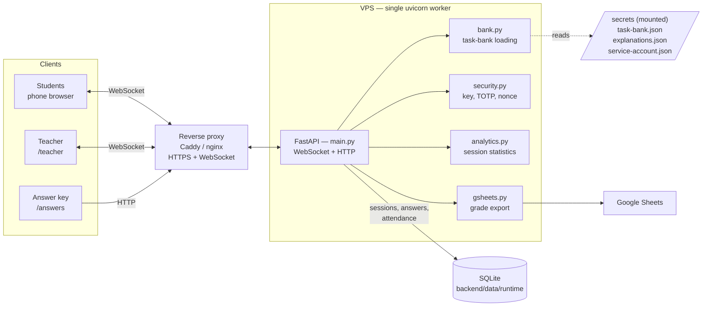

# AlgoClimb

[](LICENSE)
[](https://www.python.org/)
[](https://github.com/21astroboy/Algoclimb/actions/workflows/ci.yml)

AlgoClimb is a self-hosted web app for synchronous, interactive in-class quizzes. The whole
class answers one question at the same time: students join via a QR code and answer from their
phones, while the teacher's screen shows the lobby, live progress, and a leaderboard in real
time. When the session ends, students get per-task explanations.

The app is not tied to any subject. The teacher supplies **their own task bank** (JSON) and
runs quizzes on programming, databases, algorithms, graph theory, or any other discipline.
Topics, difficulty levels, sets, and explanations are declared right in the bank — the UI
builds its filters from whatever it finds there. A small demo bank is included so you can try
the app without your own data.

The backend is built on **FastAPI** (a single `uvicorn` process; session state is kept in
memory). The frontend is static HTML pages. Session history is stored in SQLite and survives
restarts.

## Contents

- [Features](#features)
- [Architecture](#architecture)
- [Screenshots](#screenshots)
- [Project structure](#project-structure)
- [Session flow](#session-flow)
- [Task bank](#task-bank)
- [Quick start (local)](#quick-start-local)
- [Screens](#screens)
- [API](#api)
- [Deployment (VPS)](#deployment-vps)
- [Grade export](#grade-export)
- [Configuration](#configuration)
- [Author and license](#author-and-license)

## Features

- **Subject-agnostic.** Drop in your own JSON task bank and quiz any discipline; the UI builds
  topic, type, level, and set filters from the bank's contents.
- **Synchronous play.** The whole class answers the same question at once, with a per-question
  timer, one attempt per question, and shuffled options each round.
- **Real-time teacher view.** Live lobby, progress, answered counter, leaderboard, and
  tab-switch flags over WebSocket.
- **Resilient connections.** Clients reconnect automatically after a drop and restore their
  state from the server.
- **Five question types.** `choice` and `blank` work for any subject; `graph`, `order`, and
  `sort` are built for algorithms and graph theory.
- **Scoring with streak bonus.** Points follow `base × difficulty × speed`, with a bonus for
  streaks of correct answers.
- **Private answer keys.** The bank with correct answers is mounted from `secrets/` and never
  ships in the repository or the Docker image.
- **Persistent history.** Attendance, answers, and results are written to SQLite and survive
  restarts and rebuilds.
- **One-command deploy.** `./algoclimb up` auto-detects Docker or Python and starts the app.

## Architecture



Clients talk to the server over WebSocket; on a dropped connection the page reconnects and
restores its state from the server. The question bank with correct answers is read from the
mounted `secrets/` folder and is not part of the repository or the Docker image.

> **Important:** there must be exactly one worker — session state lives in the process memory.
> Running with `--workers` is not supported.

## Screenshots

> Place the images under `docs/` with the names below (PNG or GIF). Until you add them, these
> links will render as broken image placeholders.

| Teacher screen | Student screen |
|----------------|----------------|
|  |  |

## Project structure

```
backend/     FastAPI application
  main.py      WebSocket session + HTTP routes
  bank.py      task-bank loading (falls back to the demo bank)
  db.py        SQLite layer (attendance, answers, results, events, sessions)
  security.py  teacher key, TOTP codes, one-time nonces
  analytics.py per-session and per-task statistics
  gsheets.py   grade export to Google Sheets
  config/      config.example.json — configuration template
  data/        demo bank + runtime/ (SQLite DB, session logs)
frontend/    HTML: teacher / student / answers + vendor/ (KaTeX)
secrets/     private bank, explanations, service-account key (mounted)
tools/       helper scripts
```

## Session flow

The model is synchronous: the whole class answers one question at the same time.

1. The teacher opens `/teacher` — a QR code and the lobby appear.
2. Students scan the QR, enter a nickname, and pick an icon. Attendance is recorded at this
   moment.
3. The teacher starts the session — everyone receives the first question.
4. Each question has a timer. A round closes once everyone has answered or the time runs out,
   then the next question is handed out. One attempt per question.
5. Points follow `base × difficulty × speed`, with a bonus for streaks of correct answers. A
   wrong or skipped answer scores 0. Options are shuffled every round.
6. The teacher's screen shows progress, the leaderboard, the answered counter, and tab-switch
   flags.
7. When the session ends, results are shown and written to the database, and students get
   access to the task explanations.

## Task bank

The app is not tied to a subject: its content is fully defined by the task bank — a JSON file
that the teacher prepares. The UI builds filters for topics, types, levels, and sets from
whatever is present in the bank.

The bank is loaded from the first available source, in priority order: the path in the
`TASK_BANK_PATH` variable, then `secrets/task-bank.json`, then `backend/data/task-bank.json`.
If none is found, the demo bank `backend/data/task-bank.example.json` is used. The private bank
is mounted from `secrets/` and is not part of the repository or the Docker image.

Each task is an object with the following fields:

| Field | Purpose |
|-------|---------|
| `id` | unique task identifier |
| `type` | question type (see below) |
| `topic` | topic; an arbitrary string that a filter is built from |
| `level` | difficulty `1`–`3`; affects scoring |
| `title` | short title |
| `prompt` | task text |
| `hint` | hint (optional) |
| `block` | membership in a task set (optional) |

Five question types are supported. Two of them are universal and fit any subject:

- **`choice`** — pick one option out of several.
- **`blank`** — fill in a gap: free text with accepted answers, or a pick from a dropdown.

The other three are specialized for algorithms and graph theory: **`graph`** (build a graph),
**`order`** (traversal order), and **`sort`** (sorting). For quizzes in other disciplines,
`choice` and `blank` are enough.

Task explanations are stored separately — in an `explanations.json` file (the source is set by
`EXPLANATIONS_PATH`, otherwise `secrets/explanations.json` or
`backend/data/explanations.json`). It is a JSON object where the key is a task `id` and the
value is the explanation text. The file is optional: if it is missing, no explanation is shown.
An explanation is shown to students after the session ends only for the tasks the teacher
described in it.

### Example bank

A bank is a JSON array of tasks. The two universal types (`choice` and `blank`) are enough for
any subject; topics and sets are arbitrary strings that the UI turns into filters. A two-task
example about databases:

```json
[
  {
    "id": "sql_join_inner",
    "type": "choice",
    "topic": "SQL: joins",
    "level": 1,
    "title": "INNER JOIN",
    "prompt": "What does an INNER JOIN of two tables return?",
    "options": [
      "Only rows whose key matches in both tables",
      "All rows from the left table",
      "All rows from both tables without a condition",
      "Rows that have no match"
    ],
    "answer": 0
  },
  {
    "id": "sql_group_by",
    "type": "blank",
    "topic": "SQL: aggregation",
    "level": 2,
    "title": "Count per city",
    "prompt": "Fill in the gaps to count the number of users in each city.",
    "hint": "An aggregate function plus grouping.",
    "block": "SQL: basics",
    "template": "SELECT city, ___(*) FROM users ___ BY city;",
    "blanks": [
      { "answer": "COUNT", "alts": ["count"] },
      { "answer": "GROUP", "options": ["GROUP", "ORDER", "HAVING"] }
    ]
  }
]
```

How to read it:

- Common fields on every task are `id`, `type`, `topic`, `level`, `title`, `prompt`; `hint` and
  `block` are optional.
- **`choice`:** `options` is the list of choices, `answer` is the index of the correct one
  (zero-based).
- **`blank`:** in `template`, each gap is marked with `___` (three underscores), and the
  `blanks` array describes them in order. A gap with an `options` list becomes a dropdown;
  without `options` it is free text, where `answer` is the reference value and `alts` are
  additional accepted variants (case and extra whitespace are ignored). The number of `___`
  must match the length of `blanks`.

The specialized `graph`, `order`, and `sort` types use extra fields (nodes, edges, a start
node, an array, and so on) — ready samples of each live in the demo bank
`backend/data/task-bank.example.json`.

Explanations for these tasks are wired up in `explanations.json` by `id`:

```json
{
  "sql_join_inner": "An INNER JOIN keeps only pairs of rows whose key matches in both tables.",
  "sql_group_by": "COUNT(*) counts the rows in each group, and GROUP BY city forms the groups by city."
}
```

## Quick start (local)

Requires **Python 3.11+**.

```bash
git clone https://github.com/21astroboy/Algoclimb.git algoclimb
cd algoclimb
python3 -m venv .venv && . .venv/bin/activate
pip install -r requirements.txt
python -m uvicorn main:app --app-dir backend --host 0.0.0.0 --port 3000 --ws wsproto
```

Alternatively, a single command that picks Docker or Python for you: `./algoclimb up`. The
teacher key and the screen addresses are printed to the console.

Without a private bank, the app starts on the demo bank (`task-bank.example.json`).

## Screens

| Role | Address |
|------|---------|
| Teacher | `PUBLIC_URL/teacher` — key-based login |
| Students | `PUBLIC_URL/` — the address from the QR code |
| Answer key | `PUBLIC_URL/answers` — a private page with the answers |

The `/answers` page contains the correct answers and is not meant for students.

## API

The HTTP and WebSocket endpoints are documented via OpenAPI. Interactive docs (Swagger UI) are
available at `PUBLIC_URL/docs`, ReDoc at `PUBLIC_URL/redoc`, and the schema at
`PUBLIC_URL/openapi.json`.

By default the docs are hidden (a 404 response). To enable them, set `DOCS=1` in `.env` and run
`./algoclimb restart`.

## Deployment (VPS)

The server needs **Docker** (recommended) or **Python 3.11+**. The `./algoclimb` script detects
the available environment automatically.

```bash
# 1. Get the code
git clone https://github.com/21astroboy/Algoclimb.git algoclimb
cd algoclimb

# 2. Upload the private files (task bank and explanations)
scp secrets/task-bank.json secrets/explanations.json <user>@<vps>:~/algoclimb/secrets/

# 3. Configure the environment
cp .env.example .env
nano .env
```

The minimal configuration in `.env` is the public address that goes into the QR code:

```
PUBLIC_URL=https://algoclimb.example.com   # or http://<ip>:3000
TEACHER_KEY=<permanent-key>
```

Run:

```bash
./algoclimb up        # build and start in the background; prints the teacher key
```

Other commands: `logs`, `key`, `status`, `restart`, `down`. Data in `backend/data/runtime`
persists across restarts and rebuilds.

Updating a version:

```bash
git pull
./algoclimb restart
```

Replacing files in `secrets/` does not require a rebuild (they are mounted on the fly) — a
`./algoclimb restart` is enough. After changing dependencies (`requirements.txt`), run
`./algoclimb up`.

### HTTPS and a domain

The app listens for HTTP on `PORT`. For a domain and TLS, use a reverse proxy with WebSocket
proxying enabled (forwarding the `Upgrade` and `Connection` headers). After setting it up, put
`PUBLIC_URL=https://domain` in `.env` and run `./algoclimb restart`.

Caddy proxies WebSocket with no extra configuration:

```
algoclimb.example.com {
    reverse_proxy 127.0.0.1:3000
}
```

For nginx, you need to raise the proxy timeouts: a WebSocket connection can sit idle between
questions and in the lobby, which drops it at the default timeout.

```nginx
server {
    server_name algoclimb.example.com;
    location / {
        proxy_pass http://127.0.0.1:3000;
        proxy_http_version 1.1;
        proxy_set_header Upgrade $http_upgrade;
        proxy_set_header Connection "upgrade";
        proxy_set_header Host $host;
        proxy_set_header X-Forwarded-For $proxy_add_x_forwarded_for;
        proxy_read_timeout  3600s;
        proxy_send_timeout  3600s;
    }
}
```

### Login security

- `TEACHER_KEY` — the access key for the teacher screen.
- `QR_ROTATION=1` enables rotating one-time login codes (TOTP): the code in the QR changes
  every `QR_INTERVAL` seconds, and logging in again with a stale code is not possible.
- Swagger `/docs` is hidden by default; it is enabled via `DOCS=1`.

## Grade export

When a session ends, the teacher screen offers to export the results to an external
spreadsheet. A preview shows who gets scored and into which column, without changing the sheet;
the export itself adds a new column and leaves absent participants untouched.

The integration is optional and disabled by default. Connection parameters are set in the
configuration and environment variables; the setup details are out of scope for this document.

## Configuration — `backend/config/config.json`

The working `config.json` is not stored in the repository; `config.example.json` serves as a
template. The main parameters:

- **demo** — pick `count` random tasks for a demo (`onePerType` — one of each type). Disabling
  it uses the whole bank.
- **timeLimits** — the time limit per question, by task type.
- **scoring** — `base`, `minFraction` (the minimum fraction of points), `streakStep` /
  `streakMax` (the streak bonus).
- **activeTasks** — an empty value uses the whole bank; otherwise a list of task identifiers in
  a given order.
- **qrRotation** — the rotating one-time login-code mode.
- **gsheets** — grade-export parameters.

A number of parameters are mirrored by environment variables (`QR_ROTATION`, `DOCS`, `GSHEETS`,
and others); the full list is described in `.env.example`.

## Author and license

Idea, design, and development of AlgoClimb — Kirill ([@21astroboy](https://github.com/21astroboy)).
Copyright © 2026 Kirill (@21astroboy).

The project is distributed under the **GNU Affero General Public License v3.0 (AGPL-3.0)**. Use,
modification, and distribution are permitted provided that derivative works are also published
under AGPL-3.0, with the authorship and the license text preserved. The key difference between
AGPL and the regular GPL is the network-use clause: anyone who deploys a modified version as a
service (including over a network) must provide users with the source code of their version.
The full text is in the [`LICENSE`](LICENSE) file.
